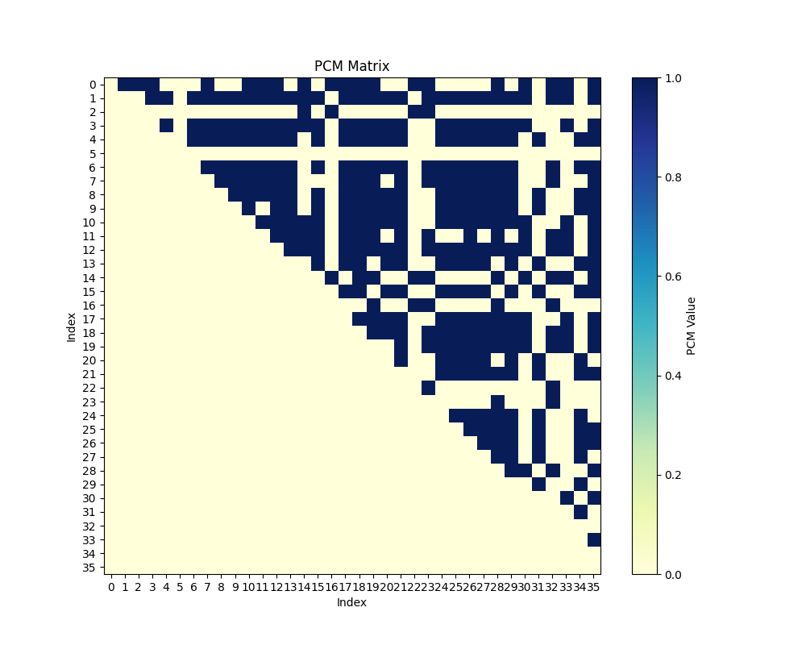
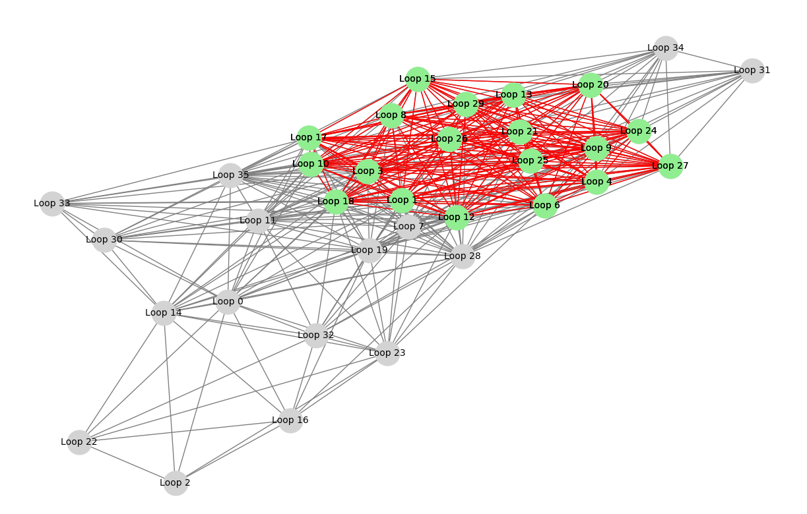
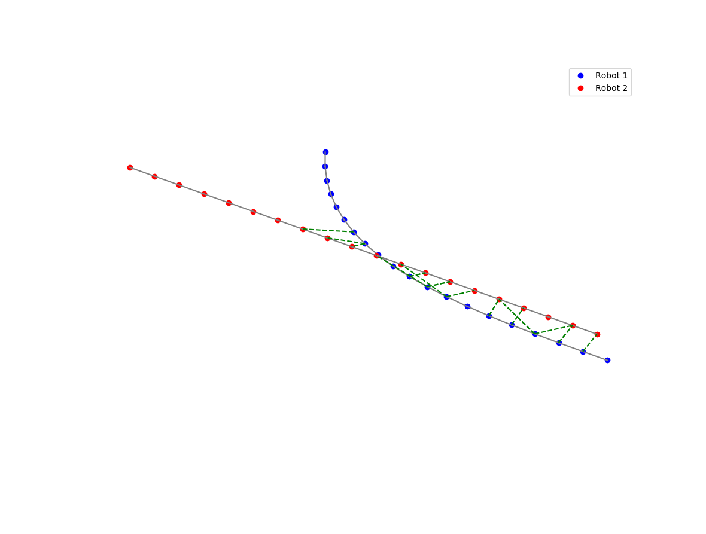

# PCM_gtsam
Visual representation and example of pairwise consistency maximization of factor-graph (Pose-graph). Utilizes Networkx, GTSAM, python for optimization.
All pose and graph structures are represented in Pose3, Rot3, Point3, and etc. provided in GTSAM.
Further applications including optimization and comparison of before and after outlier rejection will be updated(2024/11/12)


### What is PCM?
PCM requires several assumption and metric to determine 
if two inter-robot measurement **z**<sub>ik</sub><sup>ab</sup> and **z**<sub>jl</sub><sup>ab</sup> are pairwise consistent
Covariance function of inter-robot loop-pair is defined as following:
<p align="center">
$\mathcal{C} \left( \mathbf{z}_{ik}^{ab}, \mathbf{z}_{jl}^{ab} \right) = \left\lVert \left( \ominus \mathbf{z}_{ik}^{ab} \right) \oplus \hat{\mathbf{x}}_{ij}^{a} \oplus \mathbf{z}_{jl}^{ab} \oplus \hat{\mathbf{x}}_{lk}^{b} \right\rVert_{\Sigma} \triangleq \left\lVert \boldsymbol{\epsilon}_{ikjl} \right\rVert_{\Sigma_{ikjl}}$
</p>

### Initial Step
We generate a set of pose-graph of two adjacent robot that intersect each other in SE(3).

Each robot is denoted as Robot1 and Robot2, as figure shows. 

Red-dotted lines are false-positive loop pair, and Green-dotted lines show true-positive loop pair. Each inter-robot measurement is generated by function which simulates actual behavior that is likely to occur in Loop-Detection (via Place-Recognition). 
<p align="center">
  
</p>

### Adjacency matrix and Consistency Graph Generation
The generated loop-pair now is appended into loop_queue, which does not distinctly sort the true or false positivity.

Here we designate a threshold that determines rather the consistency is over or under threshold. 

The error metric is defined from the beginning, which is a mahalanobis distance defined as a covariance function.
By comparing the consistency, we append the binary value to the adjacency matrix considering pairwise information and error, respectively. 
(adjacency matrix is a square matrix used to represent a graph. The elements of the matrix indicate whether pairs of nodes are adjacent or connected)

This repository only checks the upper triangular part of the pcm_matrix.


<p align="center">
  
</p>

### Maximum Clique
Reference : [Maximum Clique](https://learn.microsoft.com/en-us/archive/msdn-magazine/2011/october/test-run-graph-structures-and-maximum-clique) 
A clique is a subset of a graph where every node is connected to every other node.

The maximum clique problem is to find the clique with the largest size in a graph.

Based on the consistency graph, we now apply maximum-clique assumption for consistency in graph, and reject outliers that does not fullfill the clique problem in our loop-pair

<p align="center">
  
</p>

### Final Step
After the maximum-clique, we now obtain set of loop-pairs with outliers removed. Now, we can get reliable loop-pairs via pairwise consistency check. 

<p align="center">
  
</p>

With the loop pair between inter robot, the covariance propagation iteratively occurs due to optimization.
### GTSAM Version of Covariance Propagation
<p align="center">
  
</p>


### TODO
Update version with symforce

Cross-check if this concept is right 


---
For those who seek reference


Studying PGO concept with [nano-pgo](https://github.com/gisbi-kim/nano-pgo) from [Giseop Kim](https://github.com/gisbi-kim)
```
R. Smith, M. Self and P. Cheeseman,
"Estimating uncertain spatial relationships in robotics," Proceedings.
 1987 IEEE International Conference on Robotics and Automation, Raleigh, NC, USA, 1987, pp. 850-850,
 doi: 10.1109/ROBOT.1987.1087846. keywords: {Robots},

Y. Huang, T. Shan, F. Chen and B. Englot,
"DiSCo-SLAM: Distributed Scan Context-Enabled Multi-Robot LiDAR SLAM With Two-Stage Global-Local Graph Optimization,"
IEEE Robotics and Automation Letters, vol. 7, no. 2, pp. 1150-1157, April 2022,
doi: 10.1109/LRA.2021.3138156. keywords: {Robots;Robot kinematics;Simultaneous localization and mapping;Laser radar;Optimization;Robot sensing systems;Feature extraction;Multi-robot SLAM;distributed robot systems;range sensing},

@inproceedings{mangelsonPairwiseConsistentMeasurement2018,
  title = {Pairwise {{Consistent Measurement Set Maximization}} for {{Robust Multi-Robot Map Merging}}},
  booktitle = {2018 {{IEEE International Conference}} on {{Robotics}} and {{Automation}} ({{ICRA}})},
  author = {Mangelson, Joshua G. and Dominic, Derrick and Eustice, Ryan M. and Vasudevan, Ram},
  year = {2018},
  month = may,
  pages = {2916--2923},
  issn = {2577-087X},
  doi = {10.1109/ICRA.2018.8460217}
}

@article{lajoieDOORSLAMDistributedOnline2020,
  title = {{{DOOR}}-{{SLAM}}: {{Distributed}}, {{Online}}, and {{Outlier Resilient SLAM}} for {{Robotic Teams}}},
  shorttitle = {{{DOOR}}-{{SLAM}}},
  author = {Lajoie, Pierre-Yves and Ramtoula, Benjamin and Chang, Yun and Carlone, Luca and Beltrame, Giovanni},
  year = {2020},
  month = apr,
  volume = {5},
  pages = {1656--1663},
  issn = {2377-3766},
  doi = {10.1109/LRA.2020.2967681},
  number = {2}
}

```
