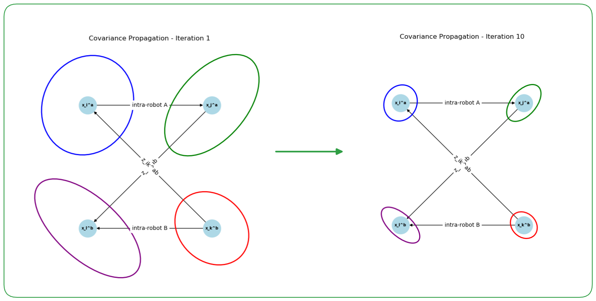

# PCM_gtsam
Visual representation and example of pairwise consistency maximization of factor-graph (Pose-graph). Utilizes Networkx, GTSAM, python for optimization.
Equation shows as following : 
<p align="center">
$\mathcal{C} \left( \mathbf{z}_{ik}^{ab}, \mathbf{z}_{jl}^{ab} \right) = \left\lVert \left( \ominus \mathbf{z}_{ik}^{ab} \right) \oplus \hat{\mathbf{x}}_{ij}^{a} \oplus \mathbf{z}_{jl}^{ab} \oplus \hat{\mathbf{x}}_{lk}^{b} \right\rVert_{\Sigma} \triangleq \left\lVert \boldsymbol{\epsilon}_{ikjl} \right\rVert_{\Sigma_{ikjl}}$
</p>


### GTSAM Version of Covariance Propagation
<p align="center">
  
</p>


### Networkx Version of Covariance Propagation
<p align="center">
  
</p>


### TODO
Update version with symforce
Cross-check if this concept is right 


---
Working with ... Estimating Uncertain Spatial Relationships in Robotics
Studying material with [nano-pgo]([https://github.com/gisbi-kim/nano-pgo]) of [Giseop Kim]([https://github.com/gisbi-kim])
```
R. Smith, M. Self and P. Cheeseman,
"Estimating uncertain spatial relationships in robotics," Proceedings.
 1987 IEEE International Conference on Robotics and Automation, Raleigh, NC, USA, 1987, pp. 850-850,
 doi: 10.1109/ROBOT.1987.1087846. keywords: {Robots},
```
