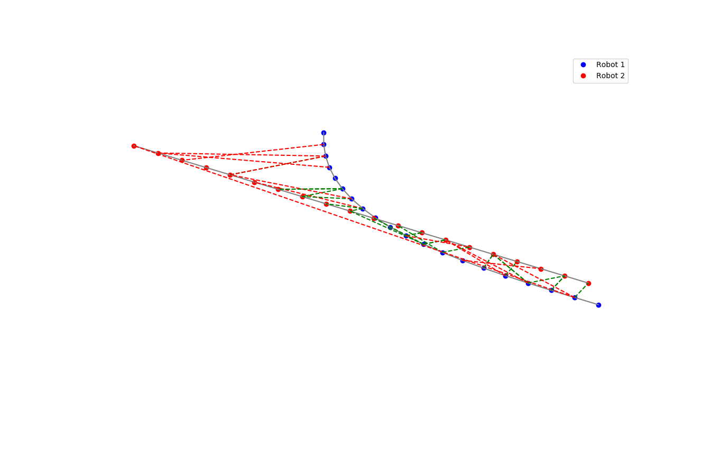
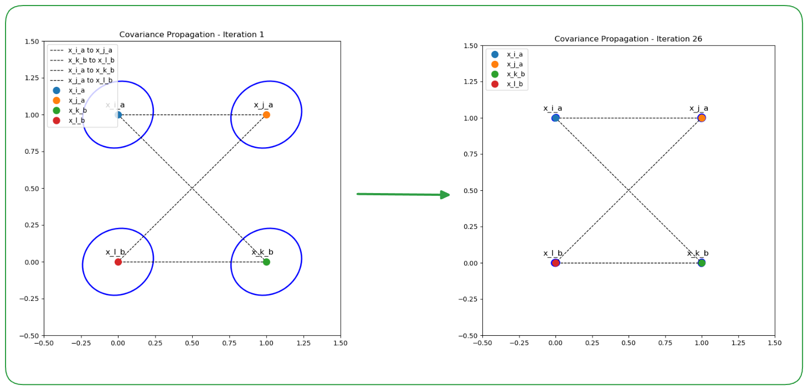

# PCM_gtsam
Visual representation and example of pairwise consistency maximization of factor-graph (Pose-graph). Utilizes Networkx, GTSAM, python for optimization.
PCM requires several assumption and metric to determine 
if two inter-robot measurement **z**<sub>ik</sub><sup>ab</sup> and **z**<sub>jl</sub><sup>ab</sup> are pairwise consistent
Covariance function of inter-robot loop-pair is defined as following:
<p align="center">
$\mathcal{C} \left( \mathbf{z}_{ik}^{ab}, \mathbf{z}_{jl}^{ab} \right) = \left\lVert \left( \ominus \mathbf{z}_{ik}^{ab} \right) \oplus \hat{\mathbf{x}}_{ij}^{a} \oplus \mathbf{z}_{jl}^{ab} \oplus \hat{\mathbf{x}}_{lk}^{b} \right\rVert_{\Sigma} \triangleq \left\lVert \boldsymbol{\epsilon}_{ikjl} \right\rVert_{\Sigma_{ikjl}}$
</p>

### Initial Step
We generate a set of pose-graph of two adjacent robot that intersect each other in SE(3).

Each robot is denoted as Robot1 and Robot2, as figure shows.
<p align="center">
  
</p>


With the loop pair between inter robot, the covariance propagation iteratively occurs due to optimization.
### GTSAM Version of Covariance Propagation
<p align="center">
  
</p>


### TODO
Update version with symforce

Cross-check if this concept is right 


---
For those who seek reference


Studying PGO concept with [nano-pgo](https://github.com/gisbi-kim/nano-pgo) from [Giseop Kim](https://github.com/gisbi-kim)
```
R. Smith, M. Self and P. Cheeseman,
"Estimating uncertain spatial relationships in robotics," Proceedings.
 1987 IEEE International Conference on Robotics and Automation, Raleigh, NC, USA, 1987, pp. 850-850,
 doi: 10.1109/ROBOT.1987.1087846. keywords: {Robots},
```
