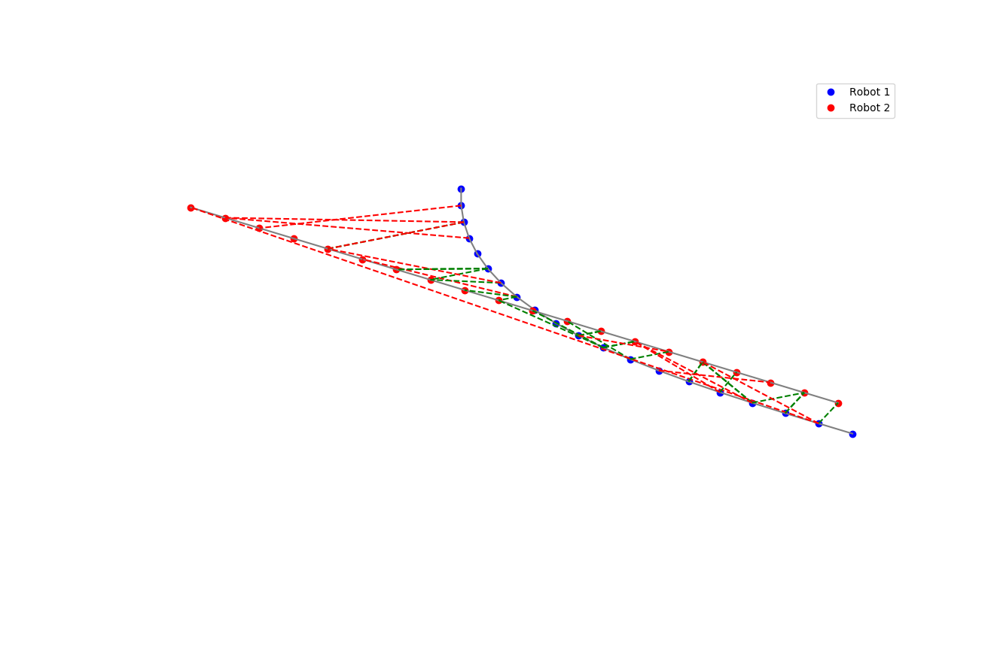
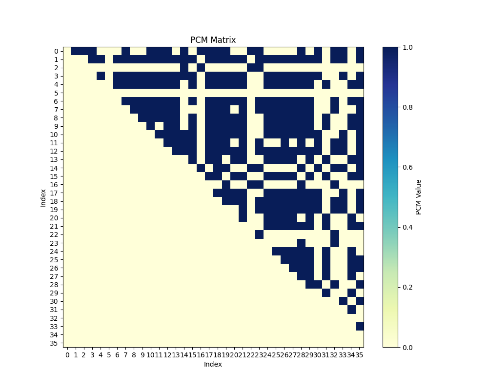
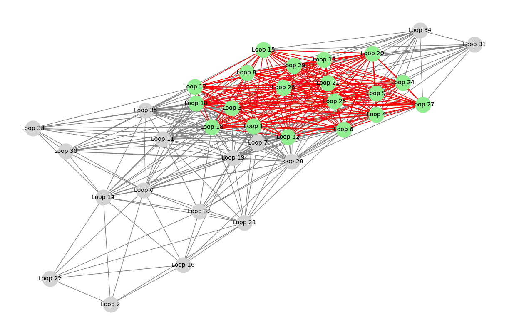
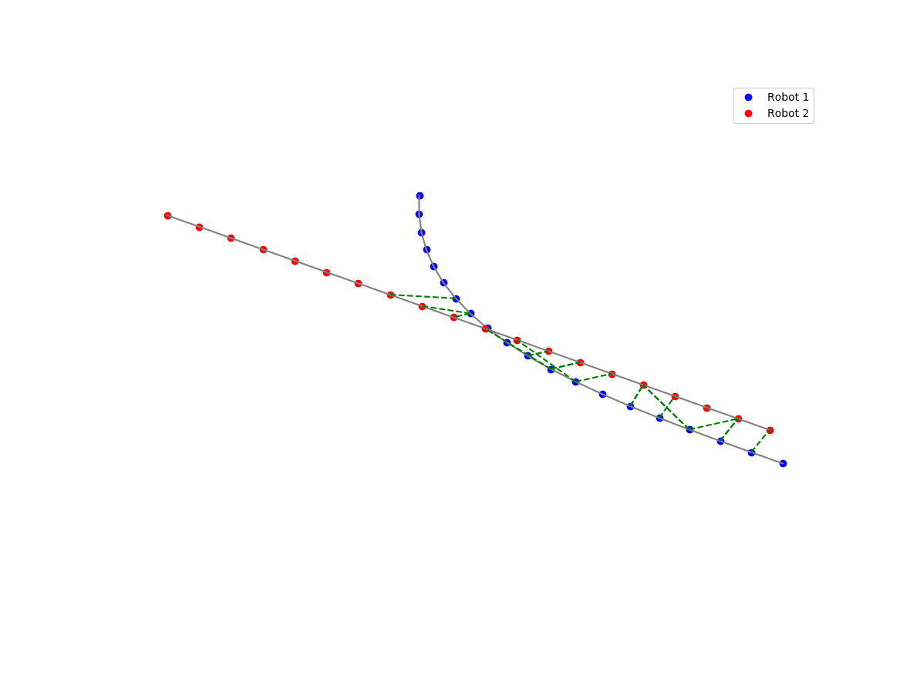
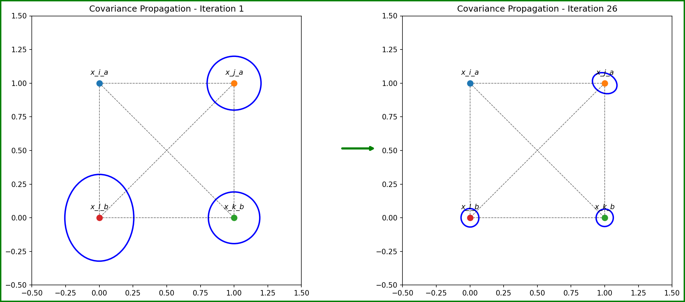

# PCM_gtsam

A hands-on learning repository for **Pairwise Consistent Measurement (PCM)** — a technique used in multi-robot SLAM to reject false loop closures between robots.

If you're studying multi-robot systems, pose-graph optimization, or outlier rejection in robotics, this repository walks you through the full PCM pipeline with runnable code and visualizations.

---

## Table of Contents

1. [What Problem Does PCM Solve?](#what-problem-does-pcm-solve)
2. [How PCM Works (Step by Step)](#how-pcm-works-step-by-step)
3. [Repository Structure](#repository-structure)
4. [Getting Started](#getting-started)
5. [Tutorial: Lightweight Pipeline (net_pcm.py)](#tutorial-lightweight-pipeline-net_pcmpy)
6. [Tutorial: GTSAM Pipeline (gtsam_pcm)](#tutorial-gtsam-pipeline-gtsam_pcm)
7. [Understanding the Output](#understanding-the-output)
8. [Running the Tests](#running-the-tests)
9. [References and Further Reading](#references-and-further-reading)

---

## What Problem Does PCM Solve?

When two robots explore the same environment, they can detect **loop closures** — measurements suggesting that a pose from Robot A corresponds to a pose from Robot B. These loop closures are essential for merging their maps.

However, some of these detections are **wrong** (false positives). If you blindly trust all loop closures, the merged map becomes distorted. PCM helps you figure out **which loop closures to keep and which to throw away**.

<p align="center">
  
</p>

> **Figure:** A synthetic two-robot scenario. Green dashed lines are true loop closures; red dashed lines are false ones. PCM's job is to separate them.

---

## How PCM Works (Step by Step)

The core idea: **true loop closures should be geometrically consistent with each other**. If two loop closures both tell a coherent story about where the robots are, they're probably both correct. If they contradict each other, at least one is wrong.

### Step 1 — Collect Loop Closure Pairs

Each loop closure is a measurement connecting a pose from Robot A to a pose from Robot B, along with a relative transformation (how one pose relates to the other).

### Step 2 — Check Pairwise Consistency

For every pair of loop closures, PCM computes a **consistency residual**. Given two inter-robot measurements, the residual checks whether traversing a cycle through both measurements and the robots' own odometry returns you to where you started:

<p align="center">

$\mathcal{C} \left( \mathbf{z}\_{ik}^{ab}, \mathbf{z}\_{jl}^{ab} \right) = \left\lVert \left( \ominus \mathbf{z}\_{ik}^{ab} \right) \oplus \hat{\mathbf{x}}\_{ij}^{a} \oplus \mathbf{z}\_{jl}^{ab} \oplus \hat{\mathbf{x}}\_{lk}^{b} \right\rVert\_{\Sigma} \triangleq \left\lVert \boldsymbol{\epsilon}\_{ikjl} \right\rVert\_{\Sigma\_{ikjl}}$

</p>

In plain terms: compose the transformations around the loop. If the result is close to identity (small residual), the two measurements are **consistent**. If the residual exceeds a threshold, they are **inconsistent**.

This produces a binary **adjacency matrix** — a table where entry (i, j) is 1 if loop closures i and j are consistent, and 0 otherwise.

<p align="center">
  
</p>

### Step 3 — Build the Consistency Graph

Convert the adjacency matrix into a graph. Each loop closure becomes a **node**. An **edge** connects two nodes if their corresponding loop closures are pairwise consistent.

### Step 4 — Solve the Maximum Clique Problem

A **clique** in a graph is a subset of nodes where every pair is connected (i.e., every pair of loop closures in the clique is mutually consistent). The **maximum clique** is the largest such subset.

The loop closures in the maximum clique are your **inliers** — the ones you keep.

<p align="center">
  
</p>

> **Figure:** The consistency graph. Nodes in the green subgraph form the maximum clique — these are the accepted inlier loop closures.

### Step 5 — Use the Inliers

After filtering, only the consistent loop closures remain. These can be safely used for map merging or distributed pose-graph optimization.

<p align="center">
  
</p>

> **Figure:** The pose graph after PCM filtering. Only inlier loop closures survive.

---

## Repository Structure

This repository provides **two parallel implementations** of the same algorithm, so you can study PCM at different levels of complexity:

```
PCM_gtsam/
├── pcm_common.py                  # Shared utilities (graph building, clique solving, metrics)
├── net_pcm.py                     # Lightweight pipeline (NumPy + NetworkX, no GTSAM needed)
├── gtsam_pcm/
│   ├── __init__.py                # Package exports
│   ├── gtsam_pcm.py              # Full pipeline (GTSAM Pose3, covariance tracking, animations)
│   └── covariance_propagation.py  # Compatibility re-export wrapper
├── tests/
│   ├── conftest.py                # Headless matplotlib setup
│   ├── test_net_pcm.py            # Tests for lightweight pipeline
│   └── test_gtsam_pcm.py          # Tests for GTSAM pipeline (auto-skips without gtsam)
├── figure/                        # Diagrams used in this README
└── results/                       # Output artifacts (JSON + CSV) from demo runs
```

### Which file does what?

| File | Purpose | Dependencies |
|------|---------|--------------|
| `pcm_common.py` | Shared functions used by both pipelines: graph construction, maximum clique, metrics computation, artifact saving | `networkx` |
| `net_pcm.py` | Complete PCM demo using simple 6-DOF pose lists. Great starting point for understanding the algorithm. | `numpy`, `scipy`, `networkx`, `matplotlib` |
| `gtsam_pcm/gtsam_pcm.py` | Full PCM demo using GTSAM's Pose3 and Lie-group math. Adds sliding-window PCM, covariance propagation, and animated visualization. | All above + `gtsam` |

### Key Data Types

Both pipelines use **NamedTuples** for loop closure entries, making the code self-documenting:

```python
# Lightweight pipeline (net_pcm.py)
class NetLoopClosure(NamedTuple):
    idx_a: int            # Pose index in Robot A
    idx_b: int            # Pose index in Robot B
    relative_pose: list   # 6-element list [roll, pitch, yaw, x, y, z]

# GTSAM pipeline (gtsam_pcm/gtsam_pcm.py)
class GTSAMLoopClosure(NamedTuple):
    idx_a: int            # Pose index in Robot A
    idx_b: int            # Pose index in Robot B
    pose_a: Pose3         # Robot A's pose at idx_a
    pose_b: Pose3         # Robot B's pose at idx_b
    relative_pose: Pose3  # Measured relative transformation
    is_true_positive: bool  # Ground-truth label (for evaluation)
```

---

## Getting Started

### Prerequisites

Python 3.10+ with the following packages:

```bash
pip install numpy scipy networkx matplotlib pytest
```

For the GTSAM pipeline (optional):

```bash
pip install gtsam
```

### Run Your First Demo

**Lightweight pipeline** (no GTSAM needed):

```bash
python3 net_pcm.py
```

This opens matplotlib windows showing each step of the algorithm. Close each plot window to advance to the next step.

**Headless mode** (no GUI, just console output):

```bash
MPLBACKEND=Agg MPLCONFIGDIR=/tmp python3 net_pcm.py
```

**GTSAM pipeline** (requires `gtsam`):

```bash
python3 gtsam_pcm/gtsam_pcm.py
```

---

## Tutorial: Lightweight Pipeline (net_pcm.py)

This is the best place to start. Open `net_pcm.py` and follow along.

### 1. Define Your Loop Closures

The demo creates 10 synthetic loop closures in `get_example_loop_data()`. Each is a `NetLoopClosure` with two pose indices and a relative transformation:

```python
from net_pcm import NetLoopClosure

loop_queue = [
    NetLoopClosure(0, 5, [0, 0, 0, 1, 0, 0]),       # Robot A pose 0 <-> Robot B pose 5
    NetLoopClosure(1, 7, [0, 0.1, 0, 1, 1, 0]),      # Robot A pose 1 <-> Robot B pose 7
    # ... more pairs, some true, some false
]
```

### 2. Build the Adjacency Matrix

`generate_adjacency_matrix()` checks every pair of loop closures for consistency. The residual is computed by composing transformations around a cycle — if the cycle doesn't close (residual > threshold), the pair is inconsistent.

### 3. Build Graph and Solve Maximum Clique

These steps use shared functions from `pcm_common.py`:

```python
from pcm_common import generate_consistency_graph, apply_maximum_clique

consistency_graph = generate_consistency_graph(adjacency_matrix)
max_clique = apply_maximum_clique(consistency_graph)
```

### 4. Evaluate Results

```python
from pcm_common import parse_clique_indices, compute_metrics

selected = parse_clique_indices(max_clique)
metrics = compute_metrics(selected, truth_labels, total_loops=len(loop_queue))
print(f"Precision: {metrics['precision']:.3f}, Recall: {metrics['recall']:.3f}")
```

### Customize With Config

```python
from net_pcm import NetPCMConfig, run_demo

config = NetPCMConfig(
    seed=42,              # Random seed for reproducibility
    pcm_threshold=5.0,    # Consistency threshold (lower = stricter filtering)
    intensity=1.0,        # Diagonal covariance weight
    visualize=True,       # Show matplotlib plots
    save_results=True,    # Save JSON + CSV artifacts
    output_dir="results",
    run_tag="my_experiment",
)
result = run_demo(config)
```

---

## Tutorial: GTSAM Pipeline (gtsam_pcm)

This pipeline uses the same algorithm but with proper Lie-group pose composition (via GTSAM's `Pose3`), making it closer to what you'd use in a real robotics system.

### What's Different From the Lightweight Pipeline?

| Feature | net_pcm.py | gtsam_pcm.py |
|---------|-----------|--------------|
| Pose representation | 6-element list | `gtsam.Pose3` (SO(3) + translation) |
| PCM residual | Element-wise difference | Lie-group composition + Logmap |
| Sliding-window PCM | No | Yes |
| Covariance tracking | No | Yes (incremental Levenberg-Marquardt) |
| Animations | No | Yes (pose-node covariance over time) |

### Sliding-Window PCM

Instead of running PCM on all loop closures at once, the sliding-window approach processes subsets within a pose-index window, accumulating accepted inliers as the window advances. This better reflects how a real system would process data incrementally.

### Covariance Propagation

After identifying inliers, the pipeline incrementally adds them as factors to a pose graph and tracks how the **marginal covariance** (uncertainty) at specific poses decreases. This shows how each accepted loop closure reduces uncertainty in the map.

<p align="center">
  
</p>

> **Figure:** Covariance trace at probed pose keys decreases as inlier loop-closure factors are added to the graph.

### Full Configuration Example

```python
from gtsam_pcm.gtsam_pcm import GTSAMPCMConfig, run_demo

config = GTSAMPCMConfig(
    seed=0,
    num_poses=20,                         # Number of poses per robot
    num_loop_attempts=40,                  # Total loop closure candidates to generate
    true_positive_attempts=30,             # How many of the first attempts are true positives
    pcm_threshold=5.0,                     # Consistency threshold
    use_sliding_window_pcm=True,           # Enable sliding-window mode
    pcm_window_size=8,                     # Window width in pose indices
    pcm_window_step=1,                     # Step size between windows
    track_covariance_progression=True,     # Track uncertainty reduction
    covariance_probe_indices=(10,),        # Which pose indices to monitor
    animate_pose_covariance_nodes=True,    # Animate node-level covariance
    visualize=True,
    save_results=True,
)
result = run_demo(config)
```

---

## Understanding the Output

### Console Metrics

Every run prints a summary like:

```
Precision=0.857, Recall=1.000, F1=0.923, RejectionRatio=0.222, MaxCliqueSize=28
```

| Metric | What It Means |
|--------|---------------|
| **Precision** | Of the loop closures PCM accepted, what fraction are actually correct? |
| **Recall** | Of all truly correct loop closures, what fraction did PCM accept? |
| **F1** | Harmonic mean of precision and recall (overall quality score) |
| **Rejection Ratio** | Fraction of loop closures that were rejected |
| **Max Clique Size** | Number of loop closures in the maximum clique (= accepted inliers) |

### Saved Artifacts

When `save_results=True`, two files are written to the `results/` directory:

- **JSON** (`results/<run_tag>_<timestamp>.json`): Full run details including config, all metrics, selected indices, truth labels, and (GTSAM only) covariance progression data.
- **CSV** (`results/<run_tag>_summary.csv`): One-row-per-run summary, appended across runs. Useful for comparing experiments.

### GTSAM-Specific Output

The GTSAM pipeline additionally reports:

- **Covariance shrink summary**: How much uncertainty decreased from the first to last inlier factor, per probed key.
- **Sliding window history**: Per-window details of which loop closures were tested and accepted.

---

## Running the Tests

```bash
MPLBACKEND=Agg MPLCONFIGDIR=/tmp python3 -m pytest tests/ -v
```

Expected output: **9 tests pass**. If `gtsam` is not installed, the 3 GTSAM tests are automatically skipped.

To run a single test:

```bash
MPLBACKEND=Agg MPLCONFIGDIR=/tmp python3 -m pytest tests/test_net_pcm.py::test_compute_metrics_known_case -v
```

---

## References and Further Reading

If you want to dive deeper into the theory behind PCM and multi-robot SLAM:

1. **Mangelson et al.** — "Pairwise Consistent Measurement Set Maximization for Robust Multi-Robot Map Merging," *ICRA 2018.*
   The original PCM paper. Start here.

2. **Lajoie et al.** — "DOOR-SLAM: Distributed, Online, and Outlier Resilient SLAM for Robotic Teams," *RA-L 2020.*
   Applies PCM in a distributed SLAM system.

3. **Huang et al.** — "DiSCo-SLAM," *RA-L 2022.*
   Uses PCM as part of a larger multi-robot SLAM framework.

4. **Smith et al.** — "Estimating uncertain spatial relationships in robotics," *ICRA 1987.*
   Foundational work on uncertainty representation in robotics (relevant to the covariance propagation part).
